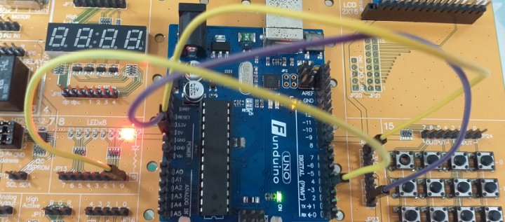

# ARDUINO_109-1
ARDUINOmemo
*學習ARDUINO 的過程*

*初始設定，只執行一次*
void setup()

*主程式，會重複執行*
void loop()

*腳位模式*
pinMode(3, OUTPUT)      //INPUT初始值=1, OUTPUT初始值=0

*寫入電位*
digitalWrite(3, HIGH)
digitalWrite(3, LOW)

*等待*
delay(500)

__第一個程式　功能：LED閃爍0.5s電路圖如下__

__2020.9.1__

      
